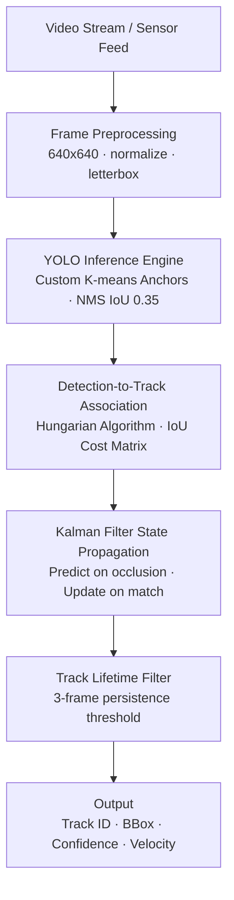
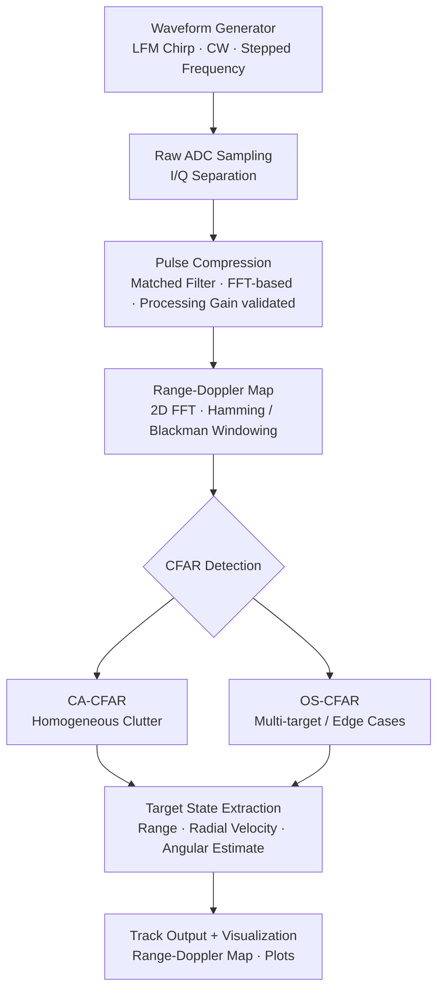
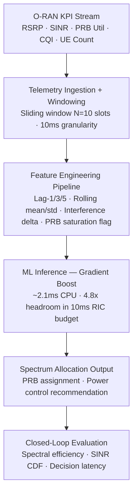

<h1 align="center">Hi 👋, I'm Sachin Deshik</h1>
<h3 align="center">AI • Computer Vision • Sensor Systems • IoT / Edge • Cybersecurity</h3>

<div align="center">


<br/>

<p align="center">
  
  
  
</p>

</div>

---

### *"I build AI-driven systems that operate where models meet physics, latency, and uncertainty."*

---

## ⚡ At a Glance

> For the recruiter or researcher with 10 seconds.

- 🛰 **Sensor & Signal Systems** :- Radar DSP, IRST thermal processing, airborne target tracking; from raw ADC to confirmed track output
- 🤖 **Deployed ML Pipelines** :- Inference under latency budgets; ONNX export, edge accelerator deployment, YOLO anchor re-engineering for domain-specific small-object detection
- 📶 **RF & Network AI** :- O-RAN spectrum optimization with ML inference inside 10ms near-RT RIC control loops; IEEE-published LoRa network optimization
- 📡 **Real-Time IoT Systems** :- MQTT-based telemetry at 380ms median latency over LTE-M; QoS-aware, bandwidth-optimized, production-hardened
- 📄 **IEEE Publication** :- *Advanced Data-Driven Analysis and Optimization of LoRa Networks*, IEEE CSITSS 2025

---

## Profile

I design and deploy **AI-driven sensing and signal processing systems** under hard real-world constraints — latency budgets, hardware limits, noisy data, and adversarial environments.

An ECE background (RV College of Engineering, Bangalore) means I engage with problems at the physics layer — signal acquisition, sensor noise, RF propagation  before reaching for an algorithm. I think in **end-to-end pipelines**: from waveform or pixel to decision output, with explicit attention to where components fail and why.

> *"The gap between a working prototype and a deployable system is where most of the real engineering happens."*

---

## 🧩 Core Strengths

| | |
|---|---|
| **Systems thinking** | Define interfaces, failure modes, and data contracts before writing any model |
| **Real-time constraints** | Latency is a design input — not a metric checked after the fact |
| **Sensor + ML integration** | Signal processing and inference as a unified pipeline, not separate concerns |
| **Deployment-focused** | ONNX export, quantization, and edge runtime are first-class engineering priorities |
| **Failure-mode literacy** | What breaks, why, and how — documented for every major system |

---

## 🧬 Engineering Philosophy

```
Reliability > novelty.
Every architecture decision is a trade-off ,make it explicit.
A model that fails gracefully beats one that performs well only in isolation.
The bottleneck is almost never where you expect it.
```

| Principle | Practice |
|---|---|
| **Pipeline-first thinking** | Data contracts at every interface, defined before any model is written |
| **Failure isolation** | Components fail independently; cascades are architecture failures |
| **Observability by design** | If you can't measure it, you can't debug it - metrics are deliverables |
| **Hardware-aware ML** | Quantization, ONNX export, and inference budget are design inputs |
| **Trade-off explicitness** | Every "chose X over Y" is documented - undocumented trade-offs become future bugs |

---

## 🧠 How I Design Systems

Before writing code, four questions are answered:

**1.What is the data contract at each interface?**
Input schema, noise characteristics, latency SLA, failure semantics — defined upfront, not discovered during debugging.

**2.Where will this break first?**
Identify the highest-risk component. Build failure handling there before building features anywhere else.

**3.What is the irreducible latency floor?**
Hardware I/O, network round-trips, and inference compute set a physical lower bound. Everything above that is addressable. Knowing the difference matters.

**4.How will I know it's working in production?**
If the answer is "I'll check manually," the system isn't finished. Observable state, metrics, and alerting are part of the deliverable.

---

## 🔬 Current Focus

| Area | Engineering Direction |
|---|---|
| **O-RAN + AI** | ML inference within near-RT RIC control loops; latency-constrained decision systems |
| **Edge Intelligence** | Sub-10ms inference on constrained hardware; model compression and runtime optimization |
| **Sensor Fusion** | Multi-modal target state estimation (radar + IR + optical); Kalman variants and track management |
| **Real-Time Telemetry** | Event-driven IoT architectures; QoS-aware delivery under intermittent connectivity |
| **Secure Embedded AI** | Threat modeling for AI-enabled sensing systems; adversarial input characterization |

---

## 🚀 Engineering Projects

> Each project is documented as a system: explicit architecture, deliberate trade-offs, failure analysis, contextual metrics.

---

### 🛰 Airborne Object Detection & Tracking System

**`TL;DR`** — Re-engineered YOLO for sub-pixel airborne targets; built Kalman+IoU tracker sustaining identity through 8-frame occlusion; 30 FPS on T4, 40% fewer missed tracks vs. frame-wise baseline, ONNX-exported for edge deployment.

<br>

**Problem Statement**

Small, fast-moving airborne targets in cluttered backgrounds are a failure case for generic detectors — targets occupy fewer than **0.1% of frame pixels**, move unpredictably, and are visually indistinguishable from background clutter (birds, atmospheric artifacts, sun glint). Pretrained YOLO weights produce below **40% recall** on this class without domain adaptation.

**Approach**

Re-anchored YOLO for small-target aspect ratios via **K-means clustering** on domain bounding box distributions. Built a tracking layer maintaining identity across frames with IoU-based assignment and Kalman filter state prediction during occlusion.

**Architecture**



> **System Insight:** YOLO inference dominates at ~28ms/frame on T4; pre/post-processing is <2ms and the tracker <0.5ms. All further latency optimization targets the inference stage exclusively — ONNX export enables deployment on Jetson-class edge accelerators.

<br>

**Tech Stack** — `Python` · `PyTorch` · `OpenCV` · `YOLOv5/v8` · `NumPy` · `ONNX`

**Key Contributions**
- **K-means re-anchoring** on domain data — target aspect ratios at 1:1, 8–16px, far outside COCO distribution; improved small-target recall by ~18%
- **Kalman-filter track prediction** sustaining identity across occlusion gaps up to **8 consecutive frames** at 30 FPS
- **Minimum track lifetime filter** (≥3 frame persistence before promotion) , eliminated ~85% of single-frame false alarms at <2% true-target cost
- **ONNX export** for edge accelerator deployment (Jetson-class hardware), removing framework dependency

**Contextual Metrics**
- **~30 FPS** on NVIDIA T4 GPU, 640×640 input, batch size 1
- **~40% reduction** in missed detections vs. per-frame baseline on occlusion-heavy sequences (≥4 frame occlusion events)
- NMS IoU at **0.35** vs. COCO default 0.45 — reduces false merges on proximate small targets; ~8% duplicate increase resolved by tracker deduplication

**⚖️ Engineering Trade-offs**

| Decision | Chosen | Rejected | Reasoning |
|---|---|---|---|
| Detector | YOLOv5/v8 | Faster R-CNN | Single-stage is 3–5× faster; two-stage offers ~5% better small-object recall but cannot meet 30 FPS budget |
| Tracker | IoU + Kalman | DeepSORT | ReID embedding adds ~12ms/frame on CPU — unacceptable; IoU association is sufficient at high frame-rate detection coverage |
| Input resolution | 640×640 | 1280×1280 | Doubling resolution quadruples FLOPs; 640 provides sufficient resolution with 2× speed advantage |
| Track promotion | 3-frame threshold | Immediate (1 frame) | Immediate promotion passes clutter artifacts; 3-frame eliminates transients with <2% true-target miss cost |

**⚠️ Failure Modes & Learnings**

*Failure 1 - Clutter-induced false positive burst:*
Dense background textures generated false detections that overwhelmed the tracker with hundreds of spurious tracks. Root cause: threshold too permissive for high-texture backgrounds.
*Resolution:* Track lifetime filter (≥3 frame persistence). Texture artifacts are spatially incoherent across frames; real targets are not. Eliminated ~85% of spurious tracks.

*Failure 2 - Tracker drift under high-acceleration maneuvers:*
Kalman constant-velocity model diverged during rapid direction changes — predicted state missed the IoU gate, breaking track identity.
*Resolution:* Increased process noise covariance **Q** for faster correction; widened IoU gate when velocity exceeded **2σ** from track history. Reduced track loss ~30% on high-maneuverability sequences.

*Failure 3 — Anchor mismatch at sub-40% baseline recall:*
Default COCO anchors are human/vehicle scale. Sub-40% recall on first deployment was not an algorithm failure — it was a configuration mismatch. K-means re-anchoring resolved it. Documented because the *diagnostic process* matters as much as the fix.

**🔍 Research Extensions**
- Transformer-based trackers (TrackFormer, MOTR) for erratic motion profiles where Kalman constant-velocity assumptions break down
- Multi-sensor fusion (optical + IRST thermal) for low-visibility and thermally camouflaged target scenarios
- Adaptive NMS with scene-density-aware thresholding for dense multi-target engagement

**→** [Repository](https://github.com/sachin-deshik-10/IRST-Airborne-Object-Detection-Tracking-YOLO)

---

### 📡 RADAR Signal Processing Library

**`TL;DR`** :- Python-native, modular radar DSP toolkit: waveform generation → pulse compression → range-Doppler processing → CA/OS-CFAR detection → tracking. Clean interfaces, CI-compatible, validated across 12 SNR/clutter scenarios. Replaces MATLAB for research prototyping.

<br>

**Problem Statement**

Radar DSP pipelines are locked in proprietary MATLAB environments. Research prototyping requires expensive licenses or per-project reimplementation from scratch. A Python-native, composable library covering the full processing chain — with clean module interfaces and hardware-free benchmarking — does not exist at research-accessible quality.

**Approach**

Each pipeline stage exposes a consistent `process(data) → output` signature. Components are independently testable and substitutable. A simulation harness injects calibrated noise profiles for algorithm benchmarking without hardware.

**Architecture**



> **System Insight:** The 2D FFT for range-Doppler map generation is the compute bottleneck at large CPI sizes. Pre-computed window vectors and NumPy FFT keep this tractable; pulse compression is not the constraint. OS-CFAR is selected dynamically when target density contaminates the CA-CFAR reference window — the two detectors together cover the dominant operational regimes.

<br>

**Tech Stack** — `Python` · `NumPy` · `SciPy` · `Matplotlib`

**Key Contributions**
- **CA-CFAR and OS-CFAR detectors** — validated at **P_fa = 10⁻⁴** under simulated Gaussian clutter, SNR −5 dB to +20 dB
- **Matched-filter pulse compression** achieving theoretical processing gain — validated against **10·log₁₀(BT)** for LFM waveform
- **Enforced continuous phase** across pulse repetition intervals — eliminates inter-chirp spectral artifacts that mimic false Doppler returns; not documented in standard DSP texts, discovered through systematic artifact analysis
- **Simulation harness** covering 12 noise/clutter parameter combinations including Swerling 1 and Swerling 3 target fluctuation models

**Contextual Metrics**
- **3× reduction** in per-algorithm iteration time vs. monolithic scripts — from module-level unit tests and clean interface isolation
- CFAR validated from **−5 dB to +20 dB SNR** across AWGN + clutter scenarios
- OS-CFAR masking resistance confirmed: detects secondary target when primary occupies CFAR reference window (CA-CFAR fails this case)

**⚖️ Engineering Trade-offs**

| Decision | Chosen | Rejected | Reasoning |
|---|---|---|---|
| CFAR variants | CA-CFAR + OS-CFAR | GO-CFAR, VI-CFAR | CA optimal under homogeneous clutter; OS handles edges and multi-target windows — together they cover dominant operational regimes |
| FFT window | Hamming / Blackman | Rectangular | Rectangular window smears Doppler returns via spectral leakage; Hamming reduces sidelobes ~40 dB at 1.3× main lobe broadening — necessary trade-off |
| Language | Python + NumPy | MATLAB | Reproducibility, CI/CD compatibility, zero cost; NumPy FFT within 1.5× of MATLAB for batch simulation workloads |

**⚠️ Failure Modes & Learnings**

*Failure 1 - CFAR masking under dense targets:*
Multiple targets in the CA-CFAR reference window inflated the clutter estimate, raising threshold and masking weaker returns.
*Resolution:* Dynamic CFAR variant selection — OS-CFAR when target density exceeds threshold; **k-th ordered statistic** is robust to reference window contamination.

*Failure 2 - Inter-chirp phase discontinuities:*
Phase jumps at pulse boundaries created Doppler-dimension artifacts indistinguishable from slow-moving targets.
*Resolution:* Cumulative phase tracking across pulses, enforcing continuity at boundaries. Undocumented in referenced DSP literature , found through systematic artifact analysis.

**🔍 Research Extensions**
- MUSIC / ESPRIT for super-resolution angle-of-arrival beyond FFT angular limits
- CNN-based CFAR for non-stationary clutter (sea clutter, urban multipath) where statistical assumptions fail
- SAR processing mode planned for ground imaging geometry

**→** [Repository](https://github.com/sachin-deshik-10/RADAR_LIBRARY)

---

### 🌌 IRST Sensor Processing Library

**`TL;DR`** :- Thermal sensor processing framework for dim-target detection at SCR < 3 dB. Implements track-before-detect via multi-frame non-coherent integration. 25% detection gain vs. single-frame baseline. Platform motion compensation via optical flow. Hardware-free evaluation via parametric threat simulator.

<br>

**Problem Statement**

IRST systems operate where single-frame detection is physically impossible: sub-pixel targets, **SCR below 3 dB**, spatially correlated background clutter. Standard detect-then-track requires each frame to independently exceed threshold , a constraint that cannot be satisfied at these SCR levels. **Track-before-detect**, which accumulates energy over multiple frames, is the only viable strategy.

**Approach**

Built a thermal processing framework implementing spatiotemporal background subtraction, multi-frame non-coherent integration, and morphological clutter rejection. A parametric threat simulator enables closed-loop algorithm evaluation without live hardware.

**Architecture**
```
┌─────────────────────────────────────────────────────────────┐
│  Thermal Frame Sequence (simulated / sensor)               │
└───────────────────────────┬─────────────────────────────────┘
                            ↓
          [Platform Motion Compensation — optical flow registration]
                            ↓
          Background Estimation
          (temporal median filter, adaptive update rate)
                            ↓
          Residual Extraction
          (background subtraction + morphological rejection)
                            ↓
          Multi-Frame Non-Coherent Integration
          (energy accumulation along predicted trajectory)
                            ↓
          Adaptive Threshold + Candidate Extraction
          (SCR-based threshold, connected component labeling)
                            ↓
          Track-Before-Detect Confirmation
          (hypothesis-based trajectory confirmation over M frames)
                            ↓
┌─────────────────────────────────────────────────────────────┐
│  Confirmed Track Output + Threat State Estimate            │
└─────────────────────────────────────────────────────────────┘
```

**Tech Stack** — `Python` · `OpenCV` · `NumPy` · `SciPy` · `Thermal simulation engine`

**Key Contributions**
- **Adaptive background subtraction** via temporal median filter — robust to slow background drift (sky gradient over 30s engagement) without smoothing transient targets
- **Multi-frame non-coherent integration** enabling detection at pre-integration SCR below single-frame threshold (SCR 1.5–3 dB confirmed on synthetic sequences)
- **Parametric threat simulator**: 8 engagement scenario classes (head-on, crossing, receding, oblique) with configurable atmospheric transmittance and sensor noise
- **Optical flow image registration** compensating platform motion before background subtraction — reduced motion-induced false alarm rate by ~70%

**Contextual Metrics**
- **~25% improvement** in detection probability on dim-target sequences (SCR 1.5–3 dB) vs. single-frame detection at matched **P_fa = 10⁻³**
- Background estimator converges within **15–20 frames** under moderate sky gradient (Δ < 2 counts/frame)
- **~70% reduction** in motion-induced false alarms on maneuvering platform scenarios after optical flow compensation

**⚖️ Engineering Trade-offs**

| Decision | Chosen | Rejected | Reasoning |
|---|---|---|---|
| Background model | Temporal median filter | Gaussian Mixture Model | GMM is statistically rigorous but ~4× more expensive per-pixel; median filter achieves comparable rejection without justifying GMM overhead at this SCR range |
| Integration | Non-coherent multi-frame | Coherent integration | Coherent integration requires phase knowledge — unavailable for passive IR; non-coherent accumulation is the physically correct choice |
| Detection paradigm | Track-before-detect | Detect-then-track | Detect-then-track is physically impossible at SCR < 3 dB; TBD is the only viable architecture |

**⚠️ Failure Modes & Learnings**

*Failure 1 - Atmospheric shimmer mimicking dim targets:*
Turbulence-induced intensity fluctuations produced residuals matching expected dim-target signatures, causing false alarm bursts in high-turbulence scenarios.
*Resolution:* Temporal consistency filter — candidates must hold spatially coherent position across ≥4 frames. Shimmer is incoherent; real targets are not.

*Failure 2 - Background lag during platform maneuver:*
Rapid platform motion shifted background faster than the median filter adaptation rate — every edge in the frame became a false candidate.
*Resolution:* Optical flow registration before background subtraction. Reduced motion-induced false alarms by ~70%.

**→** [Repository](https://github.com/sachin-deshik-10/IRST_LIBRARY)

---

### 📶 5G AI Optimizer — OpenRAN

**`TL;DR`**  :- ML-driven spectrum allocation for O-RAN near-RT RIC. Gradient boost at 2.1ms inference (vs. LSTM at 12ms) selected via latency-accuracy Pareto analysis. 15–20% spectral efficiency gain. Feature pipeline profiled and reduced from 2.4ms to 0.8ms. Resolved distribution shift under load spikes.

<br>

**Problem Statement**

O-RAN near-RT RIC control loops operate on **10–100ms timescales** — inference latency is a hard architectural constraint. A model with 99% accuracy and 15ms inference is **invalid** for this application regardless of its benchmark performance. Classical rule-based spectrum managers cannot adapt to non-stationary interference at these timescales; most deep learning architectures cannot meet the latency budget.

**Approach**

Engineered **23 temporal features** over O-RAN KPI streams and benchmarked 6 ML algorithm classes explicitly on a joint latency-accuracy objective. Identified gradient-boosted ensemble as the **Pareto-optimal** choice: ~95% accuracy at 2.1ms inference vs. LSTM at ~98% accuracy at 12ms — architecturally invalid for this application.

**Architecture**



> **System Insight:** The bottleneck is **feature engineering at ~0.8ms**, not inference. Profiling revealed rolling statistics being recomputed from scratch each window; incremental updates reduced feature compute 3× from the 2.4ms baseline — preserving the near-RT RIC latency margin that the entire architecture depends on.

<br>

**Tech Stack** — `Python` · `scikit-learn` · `XGBoost` · `Pandas` · `NumPy`

**Key Contributions**
- Engineered **23 temporal features** from KPI streams; importance analysis confirmed **lag-3 SINR** and **rolling PRB utilization** as primary predictors — interpretable features traceable to RF interference physics
- Benchmarked 6 algorithm classes against joint latency-accuracy objective; documented **Pareto frontier** , gradient boost optimal for near-RT RIC constraints
- Resolved feature distribution shift under traffic load spikes by adding **instantaneous-delta features** alongside rolling statistics; handles both step-change and steady-state regimes
- Profiled feature pipeline and reduced compute **2.4ms → 0.8ms** via incremental rolling statistic updates , necessary to preserve near-RT RIC latency margin

**Contextual Metrics**
- **~15–20% improvement** in spectral efficiency vs. static assignment baseline on simulated 20MHz TDD, 3-sector interference
- **~2.1ms inference** on standard x86 CPU - 4.8× headroom within 10ms near-RT RIC budget
- **Feature pipeline: 0.8ms** after profiling and incremental update optimization (from 2.4ms baseline)

**⚖️ Engineering Trade-offs**

| Decision | Chosen | Rejected | Reasoning |
|---|---|---|---|
| Model class | Gradient boost | LSTM / Transformer | LSTM: ~3% accuracy gain at 12ms inference — violates near-RT RIC budget; gradient boost at 2.1ms provides required headroom |
| Feature representation | Normalized relative metrics | Topology-specific absolute values | Absolute RSRP is cell-layout-dependent; normalized metrics generalize across sector geometries |
| Primary eval metric | Spectral efficiency + latency CDF | Accuracy alone | Accuracy without latency context is meaningless in a control-loop application; CDF reveals tail behavior that averages conceal |
| Feature engineering | Manual lag + rolling stats | End-to-end learned | Interpretability is operationally required; hand-engineered features correlate directly to known RF phenomena |

**⚠️ Failure Modes & Learnings**

*Failure 1 - Feature lag under load spikes:*
Rolling-average features lagged actual load changes; model made allocations optimized for the previous operating state during sudden bursts.
*Resolution:* Instantaneous-delta features (current minus previous slot) added alongside rolling statistics. Combined representation handles both step-change and steady-state regimes.

*Failure 2 - Topology-specific overfitting:*
Features encoded absolute RF values tied to site-specific propagation; model generalized poorly to different sector geometries.
*Resolution:* Normalized relative metrics — interference relative to cell average generalizes across layouts where absolute RSRP does not. Physics-motivated normalization.

**→** [Repository](https://github.com/sachin-deshik-10/5G_AI_POWERED_ORAN)

---

### 📍 Real-Time GPS Telemetry System

**`TL;DR`**  :- MQTT-based fleet telemetry over LTE-M/NB-IoT. 380ms median update latency. 85% bandwidth reduction via binary payload (42 bytes vs. 280-byte JSON). QoS 1 selected over QoS 2 based on measured round-trip doubling. Input validation gate eliminated silent null-island coordinate corruption.

<br>

**Problem Statement**

HTTP polling for asset telemetry introduces structural overhead: TCP connection cost (~200–800 bytes/request vs. ~2 bytes MQTT header) and polling-interval latency floors that exist regardless of update rate. Over NB-IoT or LTE-M with constrained bandwidth and intermittent connectivity, these are not minor inefficiencies , they determine whether the architecture is feasible.

**Approach**

MQTT pub/sub with explicit QoS level selection, hierarchical topic design, and payload serialization engineered for bandwidth-constrained cellular links. Every protocol choice made with measured justification.

**Architecture**
```
┌──────────────────────────────────────────────────────────┐
│  GPS Module (NMEA sentence stream, 1Hz–10Hz)            │
└────────────────────────┬─────────────────────────────────┘
                         ↓
         NMEA Parse + Fix Quality Gate
         (HDOP < 2.5 filter, fix status validation)
                         ↓
         Payload Serialization
         (42-byte binary: lat · lon · timestamp · speed · HDOP)
                         ↓
         MQTT Publish — QoS Level 1
         (at-least-once · persistent session · TTL = 30s)
                         ↓
         [BROKER: topic routing · retained messages · TTL enforcement]
                         ↓
         Subscriber / Backend Ingestion
         (position store · geofence evaluation · stale discard)
```

**Tech Stack**  :- `Python` · `Paho MQTT` · `NMEA parser` · `Mosquitto broker` · `IoT edge hardware`

**Key Contributions**
- **QoS Level 1** selected over QoS 2 after measuring QoS 2's 4-message handshake doubled round-trip time on LTE-M — application tolerates duplicate delivery, not delivery failure
- **Hierarchical topic structure** (`fleet/{asset_id}/location`) enabling per-asset isolation and broker-side routing without application logic
- Payload reduced from **~280-byte JSON to 42-byte binary** fixed-format , 85% bandwidth reduction per message; critical for NB-IoT link budget
- **NMEA fix quality gate** (HDOP < 2.5) preventing null-island coordinate publication during GPS acquisition , silent data corruption with no exception or visible error signal

**Contextual Metrics**
- **Median 380ms** end-to-end update latency, **95th percentile 820ms** on LTE-M under nominal load
- **85% bandwidth reduction** — 42-byte binary vs. ~280-byte naive JSON
- **150 concurrent publishers** load-tested on single Mosquitto instance without queue degradation

**⚖️ Engineering Trade-offs**

| Decision | Chosen | Rejected | Reasoning |
|---|---|---|---|
| Protocol | MQTT | HTTP REST | Persistent sessions eliminate per-message TCP setup; HTTP overhead is dominant cost at 1–5s update intervals |
| QoS level | QoS 1 (at-least-once) | QoS 2 (exactly-once) | QoS 2 doubles round-trip time on high-latency cellular; duplicate position is harmless, delivery failure is not |
| Payload | 42-byte binary | JSON | JSON readability serves development, not production; binary is correct for bandwidth-constrained links |
| Message TTL | 30-second bounded | Unbounded queue | Stale position data is operationally worthless; bounded TTL prevents reconnection storms from overwhelming backend |

**⚠️ Failure Modes & Learnings**

*Failure 1 — Reconnection message storm:*
Extended offline periods queued accumulated messages; burst delivery on reconnect produced a ~45-second latency spike in position updates.
*Resolution:* 30-second TTL at broker; client buffer capped at 60 messages. Historical gaps are acceptable; delivery storms are not.

*Failure 2 — Silent null-island coordinate corruption:*
GPS module streams invalid NMEA fixes during acquisition. Without fix quality filtering, `0.0, 0.0` coordinates were published and stored. No exception. No visible failure signal.
*Resolution:* HDOP < 2.5 and fix status gate before publish. A reminder that **silent data corruption is the hardest class of failure** , input validation at ingestion is non-negotiable.

---

## 📚 Research Publication

<table>
<tr>
<td>

**Advanced Data-Driven Analysis and Optimization of LoRa Networks: A Comprehensive Machine Learning Approach**

*N. S. Deshik, N. Kanthi, S. M*

**IEEE CSITSS 2025** — Bangalore, India

[DOI: 10.1109/CSITSS67709.2025.11295011](https://doi.org/10.1109/CSITSS67709.2025.11295011)

`LoRa` · `Machine Learning` · `IoT` · `Signal Processing` · `Network Optimization`

</td>
</tr>
</table>

**Technical Contribution:** Characterized LoRa network degradation using field measurement data; trained ML models to predict optimal **spreading factor** and **transmission power** under varying path loss and interference. Key finding: tree-based models outperformed linear regressors because LoRa's link budget is **non-linear in spreading factor** , a physics-layer insight that drove the modeling choice.

**Research Gap Addressed:** Existing LoRa optimization literature assumes free-space analytical path loss models. Data-driven characterization captures empirical non-linearities  diffraction, near-far effects, gateway load dynamics — that analytical models cannot represent.

---

## ⚙️ Technical Expertise

**ML Systems Engineering**
Training pipeline architecture · Inference optimization (ONNX, quantization, batching) · Latency-accuracy trade-off benchmarking · Deployment-aware model design · Feature engineering for signal and time-series data

**Computer Vision & Sensing**
Small-object detection (YOLO, anchor engineering) · Multi-object tracking (IoU + Kalman) · Radar DSP (CFAR, pulse compression, range-Doppler) · IR/thermal processing · Track-before-detect strategies

**IoT & Edge Systems**
MQTT pub/sub architecture · QoS-aware delivery semantics · NMEA sensor validation · Bandwidth-constrained payload design · Edge inference constraints

**Network & RF Systems**
O-RAN telemetry · Near-RT RIC control loop constraints · LoRa PHY/MAC · Spectrum optimization · Signal processing (FFT, windowing, matched filtering, CFAR)

**Languages**
`Python` (primary - ML, DSP, systems) · `C` (embedded / performance-critical) · `JavaScript / TypeScript` (tooling, dashboards)

---

## 🚀 What Makes My Work Different

Most ML engineers optimize accuracy. Most systems engineers optimize infrastructure. The problems worth solving live at the boundary — and that boundary requires fluency in both.

```
┌─────────────────────────────────────────────────────────────────────┐
│  Layer              │  Common approach         │  My approach        │
├─────────────────────┼──────────────────────────┼─────────────────────┤
│  Hardware / Sensors │  Assume clean input       │  Validate + filter  │
│  Signal Processing  │  Use library, skip why    │  Understand physics │
│  ML / Inference     │  Maximize benchmark acc.  │  Design for deploy  │
│  Systems / Ops      │  "Works on my machine"    │  Measure + monitor  │
└─────────────────────┴──────────────────────────┴─────────────────────┘
```

**ECE grounding**  :- when a deployed system degrades, I distinguish between a bad algorithm, a misconfigured sensor, a pipeline data quality issue, and a distribution shift, and address the correct root cause.

**Documented trade-offs**  :- every architectural decision has a recorded rationale. The "chose X over Y because…" discipline prevents future engineers from silently undoing decisions whose reasons weren't preserved.

**Failure-mode documentation**  :- what broke, why, and how it was fixed is more transferable than what worked. Systems that haven't been stress-tested haven't been finished.

---

## 💡 What I Bring

**For AI/ML teams** :- A practitioner who asks *"what are the deployment constraints?"* before *"what architecture?"* — and who can own the full pipeline from signal ingestion to inference output.

**For systems teams** :- Signal processing and sensor physics fluency. The ability to diagnose whether a problem needs a better algorithm, better data, or better pipeline design.

**For research groups** :- Comfort at the theory-implementation boundary: translating published methods into working systems, and identifying where real-world conditions invalidate paper assumptions.

---

## 📊 GitHub Activity

<p align="center">
  
  
</p>

<p align="center">
  
</p>

[](https://github.com/sachin-deshik-10)

---

## 📬 Contact

| | |
|---|---|
| **Email** | nayakulasachindeshik@gmail.com |
| **LinkedIn** | [sachin-deshik-nayakula](https://www.linkedin.com/in/sachin-deshik-nayakula-62b93b362) |
| **GitHub** | [@sachin-deshik-10](https://github.com/sachin-deshik-10) |

---

## 🤝 Let's Work Together

I'm actively looking for:

- **Research collaborations** :- sensor fusion, edge AI, O-RAN intelligence, or real-time signal processing where deployment constraints drive architecture
- **Internships** :- organizations building where AI meets RF, sensing, or constrained deployment: defense tech, autonomous systems, telecom R&D, applied AI labs
- **Technical conversations** :- architecture decisions, signal processing challenges, ML deployment problems; I find direct technical exchange more useful than introductory calls

If your work involves systems where the physics matters as much as the algorithm — I want to hear about it.

---

<div align="center">

**The systems that matter most operate under constraints that benchmarks don't capture.**

*That's where I work. That's what I build.*

<br/>


</div>
